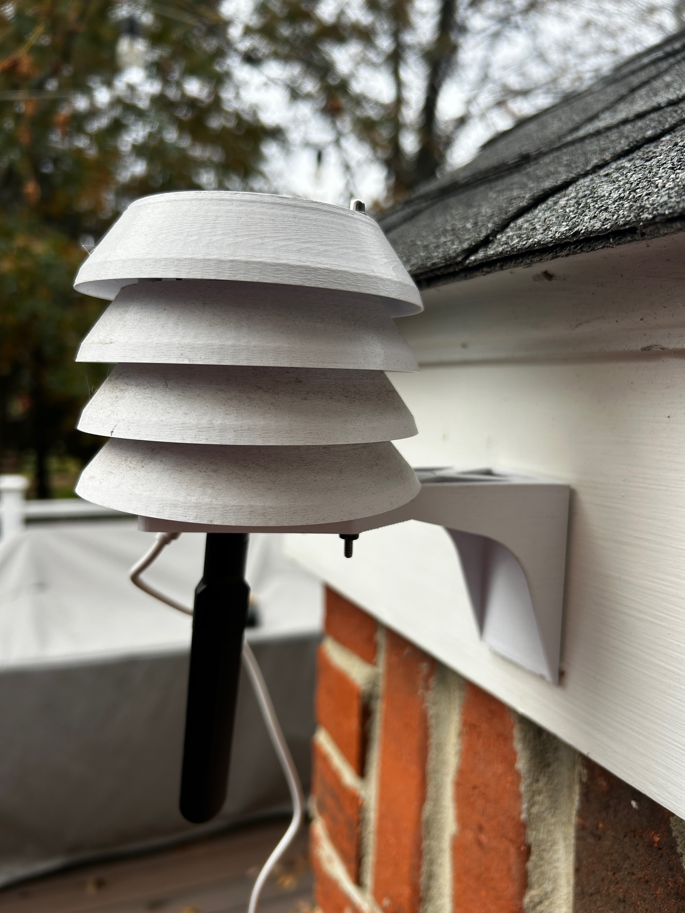
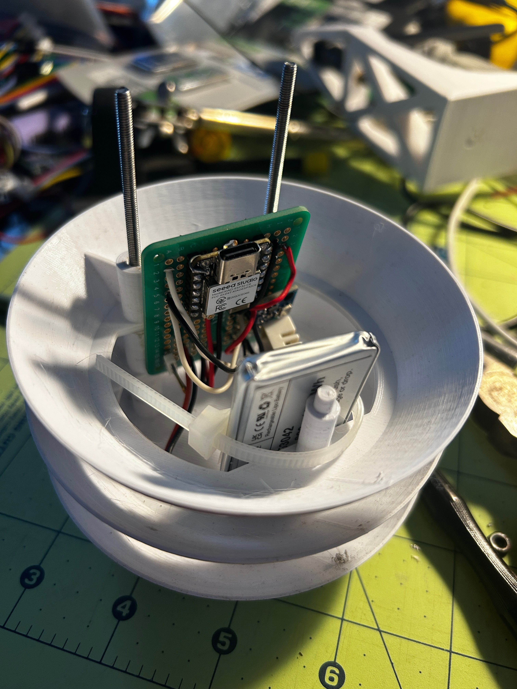
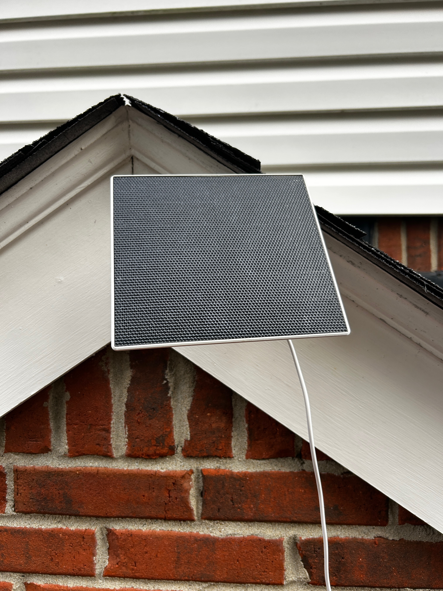
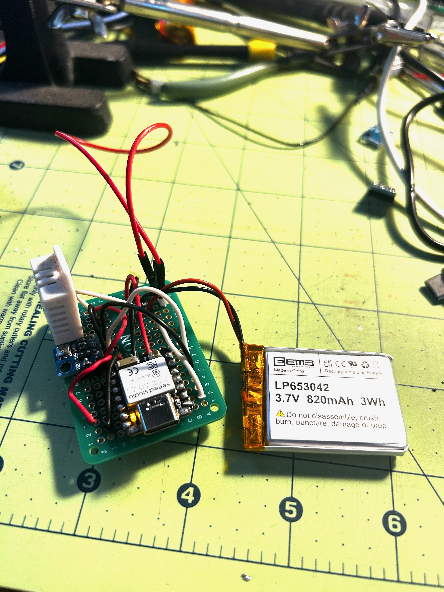
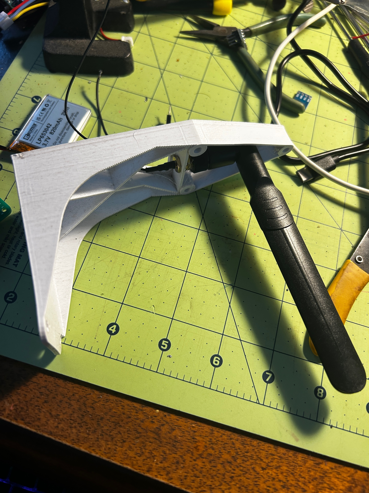

This is my home weather station built with a Seeed studio ESP32-C6

It measures temperature, pressure, humidity, and gas resistance (air quality) with a BME680 ~~DHT22 and pressure with a BMP180~~. The BME680 is a nice board, I replaced the DHT22 and the BMP180 with the BME680. Now I can measure everyting plus air quality with a simpler circuit.

It transmits the data over ESPNOW. I have an ESP8266 inside the house to receive the ESPNOW and bridge this to USB serial. On the other end of the serial USB cable is a Pi zero with a e-ink display. 

## Photos

### The Weather Station


### Stevenson Screen


The Stevenson screen housing is 3D printed using this design: https://www.thingiverse.com/thing:2970799

### Solar Panel


### Hardware Components


### External Antenna


## Technical Details

### Hardware
- **Board**: Seeed XIAO ESP32-C6
- **Sensors**:
  - BME680 via I2C - Temperature, Humidity, Pressure, and Gas Resistance (air quality) sensor breakout board
  - ~~DHT22 on GPIO1 (D1) - Temperature and humidity~~
  - ~~BMP180 via I2C - Barometric pressure~~
- **Battery monitoring**: ADC on A0 with 2:1 voltage divider
- **Status LED**: GPIO15

### Power Management
- Deep sleep mode enabled to conserve battery
- Wake interval: 60 seconds (currently set to 5 seconds for testing, configurable via `TIME_TO_SLEEP`)
- Sensor reading and data transmission occur during brief wake periods
- Current implementation reads sensors → transmits → sleeps

### Data Format
Data is transmitted via ESP-NOW as comma-separated values (CSV):
```
temperature,humidity,pressure,gas,battery
```
- Temperature in °C
- Humidity in %
- Pressure in hPa
- Gas resistance in KOhms (air quality indicator)
- Battery voltage in V

Example: `23.50,65.20,1013.25,45.32,3.85`

### Build and Upload
```bash
pio run --target upload --target monitor
```

### Configuration
Create a `config.h` file in the root directory for your receiver MAC address:
```cpp
uint8_t receiverAddress[] = {0xXX, 0xXX, 0xXX, 0xXX, 0xXX, 0xXX};
```
By default, the code uses broadcast address (0xFF:FF:FF:FF:FF:FF).
